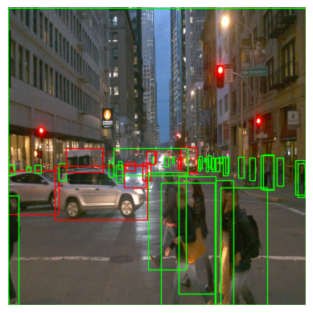
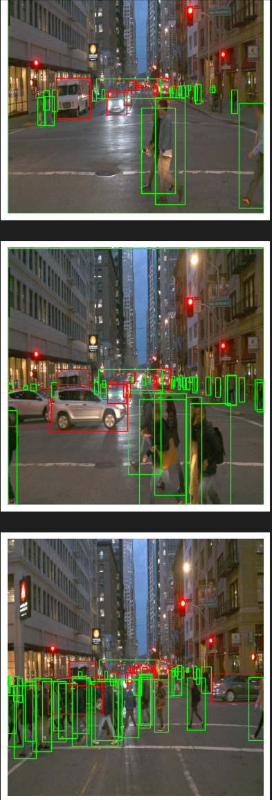

# Object Detection in an Urban Environment

## Table of contents
- [Object Detection in an Urban Environment](#object-detection-in-an-urban-environment)
  - [Table of contents](#table-of-contents)
  - [Project overview](#project-overview)
  - [Set up](#set-up)
    - [Build](#build)
    - [Open docker container terminal](#open-docker-container-terminal)
    - [Install gcloud](#install-gcloud)
    - [Download and Process Data](#download-and-process-data)
    - [Running 'Exploratory Data Analysis.ipynb'](#running-exploratory-data-analysisipynb)
  - [Dataset](#dataset)
    - [Dataset analysis](#dataset-analysis)
    - [Exploratory Data analysis](#exploratory-data-analysis)
    - [Cross validation](#cross-validation)
  - [Training](#training)
    - [Reference experiment](#reference-experiment)
    - [Improve on the reference](#improve-on-the-reference)


## Project overview

In this project we are trying to achieve best performance possible to detect vehicles, pedrestians and cyclist. For this purpouse, we use Tensorflow API and [Waymo Open dataset](https://waymo.com/open/), giving a real data to work with. 
Object detection is one of the fundamental pillars in self driving cars, such as is necessary to know what they have around them.

## Set up
Once clonning this repository, we have to go to the build folder using command-line.  

### Build
Build image using:
```
docker build -t project-dev -f Dockerfile .
```

### Open docker container terminal
In the clonned directory, run the next command:
```
.\launch_docker.bat
```
This command will open the docker container terminal where we can work with the project.

### Install gcloud
Once in container, install gsutil:
```
curl https://sdk.cloud.google.com | bash
```
Once gsutil is installed, you can auth using:
```
gcloud auth login
```
### Download and Process Data
Inside container, we can run following script to download data and get files:
```
cd /app/project
python download_process.py --data_dir /app/project/data
```

### Running 'Exploratory Data Analysis.ipynb'
This can do easily from terminal:
```
./launch_jupyter.sh
```
This will give us a url to navigate (tested in chrome browser). Copy/paste given url, enter in **Exploratory Data Analysis.ipynb** file in browser, and run all commands.

## Dataset

### Dataset analysis

### Exploratory Data analysis

Taking a look to images, can be explore that pedrestians are inside green bounding boxes, and cars between red bounding boxes, objects are classified correctly.

Also, can be observed in this first image, that at background, there is a green bounding box which should not be there because inside we have not only cars, also pedrestians.



Some multiple captures more to see results.



This images are selected because pedrestians and cars are mixed, so can be observed bounding boxes colors are correctly selected. This is city environment image, near a crosswalk, so there are more pedrestians than cars in images.
Other images, we can observe only cars, but can be used to check if algorithm works correctly.

### Cross validation

## Training

### Reference experiment

### Improve on the reference
