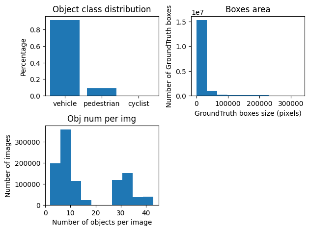
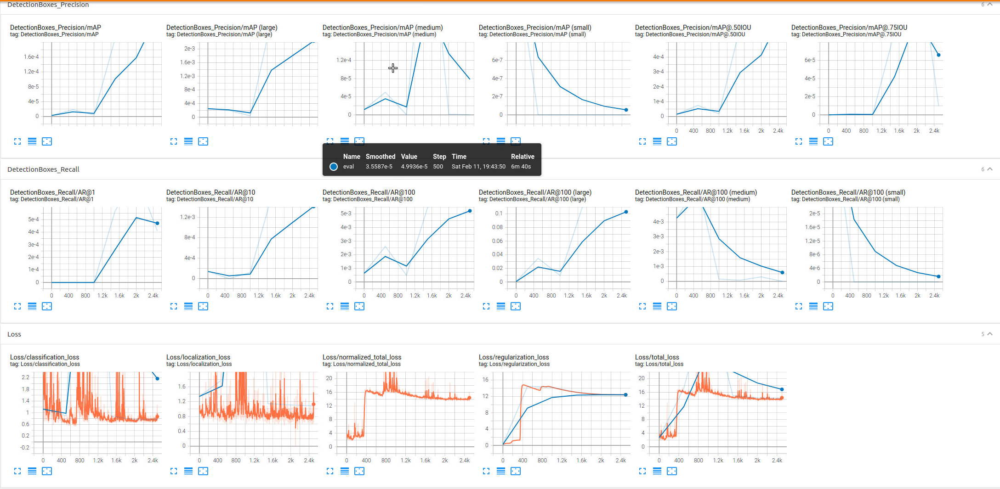
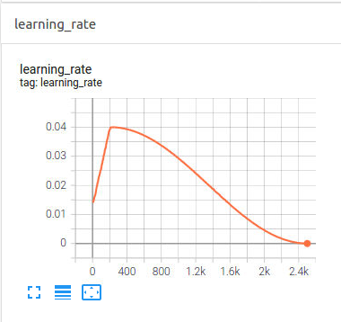
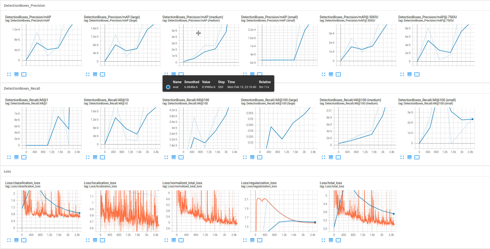
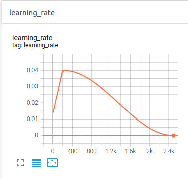
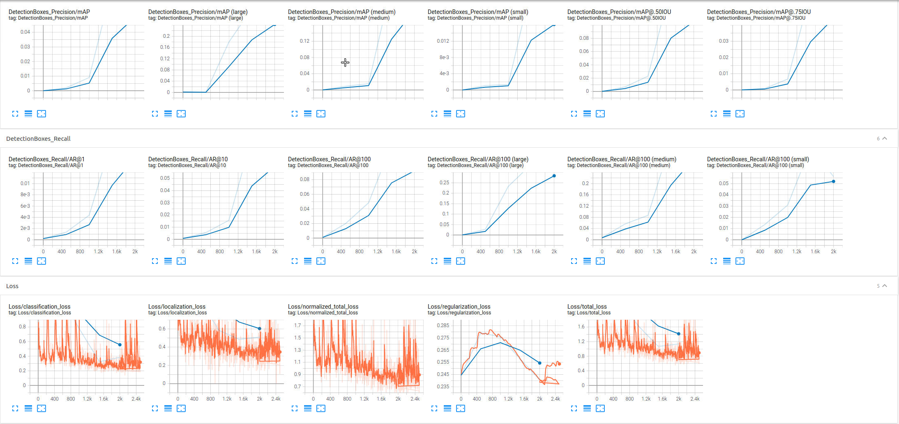
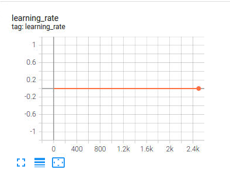

# Object Detection in an Urban Environment

## Table of contents
- [Object Detection in an Urban Environment](#object-detection-in-an-urban-environment)
  - [Table of contents](#table-of-contents)
  - [Project overview](#project-overview)
  - [Set up](#set-up)
    - [Build](#build)
    - [Open docker container terminal](#open-docker-container-terminal)
    - [Install gcloud](#install-gcloud)
    - [Download and Process Data](#download-and-process-data)
    - [Running 'Exploratory Data Analysis.ipynb'](#running-exploratory-data-analysisipynb)
      - [Additional EDA](#additional-eda)
    - [Model training and evaluation](#model-training-and-evaluation)
      - [Download pretrained models](#download-pretrained-models)
      - [Generate pipeline](#generate-pipeline)
  - [Dataset](#dataset)
    - [Dataset analysis](#dataset-analysis)
    - [Cross validation](#cross-validation)
  - [Training](#training)
    - [Reference experiment](#reference-experiment)
      - [Default configuration](#default-configuration)
      - [Default configuration with new augmentations](#default-configuration-with-new-augmentations)
      - [Default configuration changing optimizer](#default-configuration-changing-optimizer)
    - [Improve on the reference](#improve-on-the-reference)


## Project overview

In this project we are trying to achieve best performance possible to detect vehicles, pedrestians and cyclist. For this purpouse, we use Tensorflow API and [Waymo Open dataset](https://waymo.com/open/), giving a real data to work with. 
Object detection is one of the fundamental pillars in self driving cars, such as is necessary to know what they have around them.

## Set up
Once clonning this repository, we have to go to the build folder using command-line.  

### Build
Build image using:
```
docker build -t project-dev -f Dockerfile .
```

### Open docker container terminal
In the clonned directory, run the next command:
```
.\launch_docker.bat
```
This command will open the docker container terminal where we can work with the project.

### Install gcloud
Once in container, install gsutil:
```
curl https://sdk.cloud.google.com | bash
```
Once gsutil is installed, you can auth using:
```
gcloud auth login
```
### Download and Process Data
Inside container, we can run following script to download data and get files:
```
cd /app/project
python download_process.py --data_dir /app/project/data
```

### Running 'Exploratory Data Analysis.ipynb'
This can do easily from terminal:
```
./launch_jupyter.sh
```
This will give us a url to navigate (tested in chrome browser). Copy/paste given url, enter in **Exploratory Data Analysis.ipynb** file in browser, and run all commands.

Inside jupyter notebook, code has been modified to work in local machine, and comments added to know how it works.

#### Additional EDA

To generate graphs with information about data, run from terminal:

```
python create_charts.py
```

Script will use all **.tfrecord** files inside **/home/workspace/data/test/** folder. It can take too much time calculating over all data, so, **Ctrl+C** pressed, script will stop and will create a **charts.png** file like this one:



With this charts, images have a lot of vehicles more than pedrestian and cyclists. Most of boxes size have a small pixels area, and most images have between 5 and 10 objects.

### Model training and evaluation

This second part has been executed in remote computer due laptop limitations, so example paths will be changed than the previous commands.

#### Download pretrained models
Inside bash, paste following commands:
```
cd /home/workspace/experiments/pretrained_model/

wget http://download.tensorflow.org/models/object_detection/tf2/20200711/ssd_resnet50_v1_fpn_640x640_coco17_tpu-8.tar.gz

tar -xvzf ssd_resnet50_v1_fpn_640x640_coco17_tpu-8.tar.gz

rm -rf ssd_resnet50_v1_fpn_640x640_coco17_tpu-8.tar.gz
```

#### Generate pipeline

Due to the problems to execute commands correctly, need to execute first this scripts to have a compatible version of packages. **DON'T FORGET TO ENABLE GPU**

```
chmod +x /home/workspace/fix_packages_problems.sh
./home/workspace/fix_packages_problems.sh
```

Once finished, firefox doesn't crash and can explore jupyter notebooks. This fix break desktop **Visual Studio Code** link. So, to launch the editor, we need to execute:

```
chmod +x /home/workspace/launch_code.sh
./home/workspace/launch_code.sh
```

After this few steps, we can continue with work.

With following commands, we can generate pipeline to test later our data
```
cd /home/workspace/
python edit_config.py --train_dir /home/workspace/data/train/ --eval_dir /home/workspace/data/val/ --batch_size 2 --checkpoint /home/workspace/experiments/pretrained_model/ssd_resnet50_v1_fpn_640x640_coco17_tpu-8/checkpoint/ckpt-0 --label_map /home/workspace/experiments/label_map.pbtxt
```

After that, there are 2 steps to do the job, and other one to monitoring the progress/results:

1. Train model
  ```
  python experiments/model_main_tf2.py --model_dir=experiments/reference --pipeline_config_path=pipeline_new.config --checkpoint_dir=experiments/reference
  ```
2. Evaluate model
  ```
  python experiments/model_main_tf2.py --model_dir=experiments/reference/ --pipeline_config_path=pipeline_new.config --checkpoint_dir=experiments/reference/
  ```
3. Monitor progress/results
  ```
  python -m tensorboard.main --logdir experiments/reference/
  ```

When evaluate model is executed, application will say **waiting for new checkpoint at experiments/reference**. To continue the execution, open **experiments/reference/checkpoint** file and change **model_checkpoint_path** number, until all checkpoint numbers completed to have all data and can analize graphs.
## Dataset

### Dataset analysis

Taking a look to images, can be explore that pedrestians are inside green bounding boxes, and cars between red bounding boxes, so, objects are classified correctly.

Also, can be observed in the following image, at background, there is a green bounding box which should not be there because inside we have not only cars, also pedrestians. So, the model is not perfect at classification work. Anyway, the model does a good job classificating because nearest objects are correctly classified and for self driving, this is the most important thing, due car need react first for nearest obstacles.


Some multiple captures more to see results.


This images are selected after looking some others because pedrestians and cars are mixed, so can be observed bounding boxes colors are correctly selected. This is city environment image, near a crosswalk, so there are more pedrestians than cars in images.
In other images, we can observe only cars, but can be used to check if algorithm works correctly.

In previous photos, weather and our of day are similar, so results are similar. As mentioned, light of cars affects classification, and this factors would be also affect classification. If used data doesn't mix correctly all conditions images, our model will not be complete and this will can affect object detection.

### Cross validation

## Training

### Reference experiment

The reference experiment will be subdivided in three parts: default configuration, default configuration + augmentations and default configuration changing optimizer.

Used configuration files are inside **pipelines** folder.

#### Default configuration

The default configuration gives following results:




#### Default configuration with new augmentations

For this experiment, the data augmentation used is the following one:

```
data_augmentation_options {
    ssd_random_crop {

    }
  }
  data_augmentation_options {
    random_pixel_value_scale {
      minval: 0.6
    }
  }
  data_augmentation_options {
    random_horizontal_flip {
    }
  }
  data_augmentation_options {
    random_crop_image {
      min_object_covered: 0.0
      min_aspect_ratio: 0.75
      max_aspect_ratio: 3.0
      min_area: 0.75
      max_area: 1.0
      overlap_thresh: 0.0
    }
  }
  data_augmentation_options {
    random_rgb_to_gray {
    probability: 0.2
    }
  }
```
And the following images show us the results



As graphs shows, the loss goes reducing while training the model. The loss curve looks like plateau at the end, indicating that can be difficult to improve result.

#### Default configuration changing optimizer

In this experiment, the optimizer configuration used is:

```
adam_optimizer: {
  learning_rate: {
    manual_step_learning_rate {
      initial_learning_rate: .0002
      schedule {
        step: 4500
        learning_rate: .0001
      }
      schedule {
        step: 7000
        learning_rate: .00008
      }
      schedule {
        step: 10000
        learning_rate: .00004
      }
    }
  }
}
```
And the results are:



With all configurations, larger objects has better detection than small ones.

Starting with default configuration, looks like got training curve is fine, but overfitting problems are visible.

Once optimizer changed, the graphs looks better, but out of memory problems got, so all test iterations can't be executed. Anywise, the graphs got looks fine.

### Improve on the reference

As improvements, good selection of different kind of augmentations can improve model. With that, model will learn real situations instead perfectly taken data, and will be more useful to detection.

Some different augmentations has been proved, but, taking time in creating new data with different augmentations and different configurations of each one, can take long time.

For example, first pipeline generated, created images like following ones:


Once modifying augmentations, the images are different as can see here:


Other point is changing the number of iterations, batch size number or modify learning rate.

Also, different optimizer can be selected to check if data will be improved.